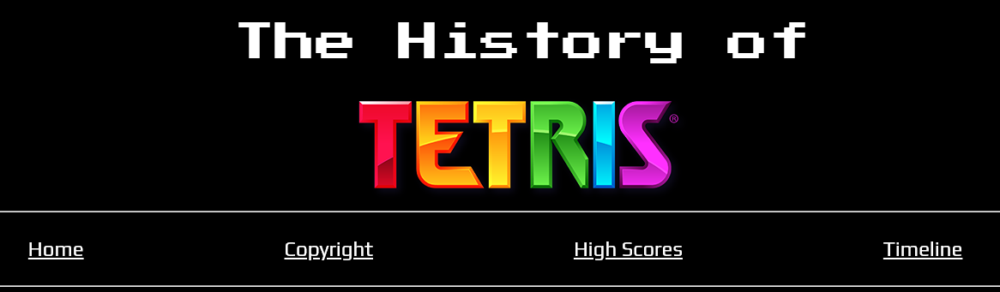
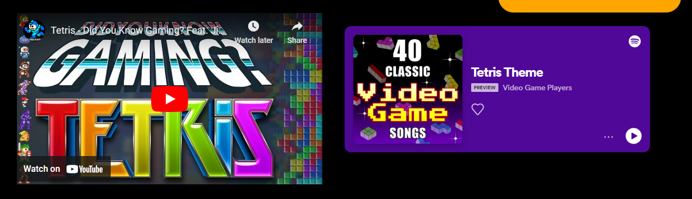
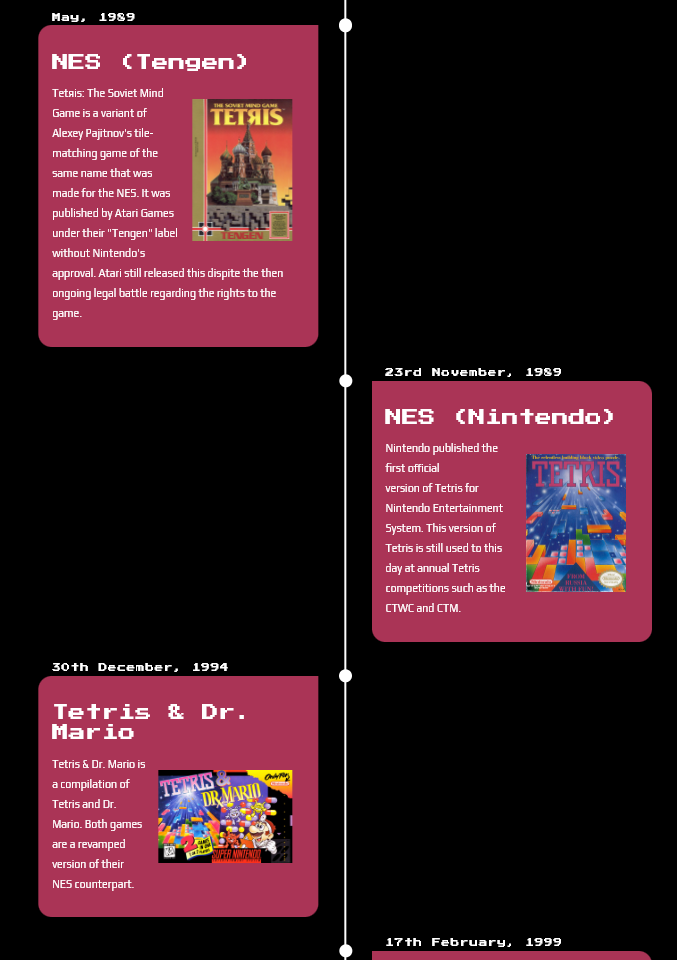
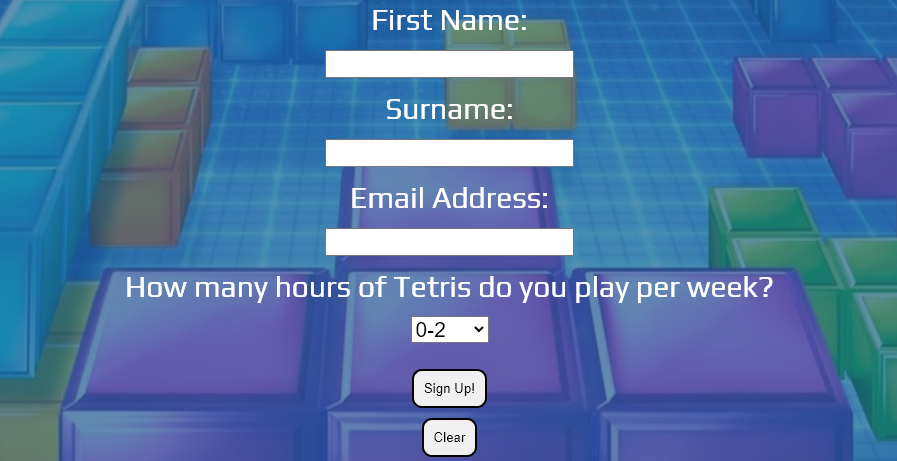
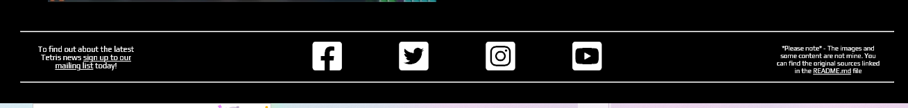

# The History of Tetris

The History of Tetris is a page dedicated to the history of one of the most popular video games to date. It offers information on Tetris' copyright and competitive scene history, as well as showing a timeline of notable versions of Tetris throughout the years in the form of a timeline. 

Users of this site will be able to find out any information they need regarding Tetris and it's history surrounding copyright, highscores/competitive scene and notable versions of the game. The target audience for this site is people of any age who have interest for Tetris.

## Features

-  ### **Header & Navigation** 

The header features on all pages, it includes a nav bar that links to the other main pages on the site. Every page has an identical header to allow for easy navigation. The Tetris logo is also clickable to get back to the home page as some users could expect this.

- ### **Embedded YouTube and Spotify**

Embedded youtube videos and spotify have been used to keep the user engaged and want to know more. 

- ### **Timeline** 

- ### **Sign up to mailing list**

- ### **Footer**

## Testing 
- N/A

## Bugs
- N/A

### Validator Testing
- HTML

    - N/A

- CSS

    - N/A

- Accessibility

    - N/A

### Unfixed Bugs
- N/A

## Deployment
- This site was deployed to GitHub pages. You can view it via the live link below:
https://stephenbeese.github.io/Portfolio-Project-1/ 

## Credits

## Content
- About Tetris section taken from Tetris Wikipedia - https://en.wikipedia.org/wiki/Tetris 

- Tetris Facts section taken from dailydot.com - https://www.dailydot.com/parsec/tetris-game-facts/

Copyright Page text taken from the following:

- http://www.atarihq.com/tsr/special/tetrishist.html

- https://www.youtube.com/watch?v=wEMHkzUOIE4 

High Scores Page text taken from the following: 

- https://tetris.wiki/Scoring#Original_Nintendo_scoring_system

- https://www.youtube.com/watch?v=bDsaQsCWbw4

- https://www.youtube.com/watch?v=n-BZ5-Q48lE&t=497s

- https://thectwc.com/history/ 

- https://www.polygon.com/23269073/competitive-classic-tetris-ctwc-jonas-neubauer-andy-michael-artiaga

- Timeline taken from: https://www.youtube.com/watch?v=zNccqv0g6Q4

Timeline text taken from the following: 

- https://tetris.fandom.com/wiki/List_of_games 

- https://en.wikipedia.org/wiki/Tetris_Party 

- https://en.wikipedia.org/wiki/Tetris_Effect 

Sign up form centering horizontally and vertically - https://www.youtube.com/watch?v=QdITQ4upjME

 ## Media

 ### Images 

- tetris-arcade.jpeg - https://www.vintagearcade.net/shop/arcade-games/tetris-arcade-game/

- tetris-nes.jpeg - https://en.wikipedia.org/wiki/Tetris_(NES_video_game)
  
- tetris-ibm-pc.webp - https://tetris.fandom.com/wiki/Tetris_(IBM_PC)

- electronica-60.png - https://awesomegames.miraheze.org/wiki/Tetris_(1984)

- Tetris-on-Game-Boy.jpeg - https://commons.wikimedia.org/wiki/File:Tetris_on_Game_Boy.jpg 

- tetris-background.jpeg - https://tetris.com/article/35/tetris-lingo-every-player-should-know

- tetris-tengen.jpeg - https://tetris.wiki/Tetris_(NES,_Tengen) 

- tetris-logo.png - https://en.wikipedia.org/wiki/The_Tetris_Company 

- tetris-gameboy.jpg - https://unsplash.com/photos/lUbIun4IL38 

- electronica-timeline.png - https://www.deviantart.com/rage-dssviper-sigma/art/Tetris-The-Grand-Master-Electronica-60-Style-569447060

- ibm-pc-timeline.png - https://online.oldgames.sk/play/dos/tetris/10050

- c64-timeline.jpeg - https://gamesdb.launchbox-app.com/games/images/144159

- gameboy-timeline.jpeg - https://www.mobygames.com/game/gameboy/tetris_gb/cover-art/gameCoverId,116199/ 

- snes-timeline.jpg - https://tetris.wiki/Tetris_%26_Dr._Mario 

- magical-timeline.png - https://www.deviantart.com/artchanxv/art/Magical-Tetris-Challenge-PS1-US-Box-Art-919440126 

- party-timeline.png - https://gamesdb.launchbox-app.com/games/images/23789 

- puyo-timeline.png - https://www.deviantart.com/goldmetalsonic/art/Puyo-Puyo-Tetris-Nintendo-Switch-Boxart-659832650 

- 99-timeline.jpg - https://www.amazon.co.uk/Tetris-99-NSO-Nintendo-Switch/dp/B07V8KPHS1 

- effect-timeline.jpeg - https://www.mobygames.com/game/playstation-4/tetris-effect/cover-art/gameCoverId,541797/ 

## Youtube / Spotify Links 

- https://www.youtube.com/watch?v=wEMHkzUOIE4 

- https://www.youtube.com/watch?v=n-BZ5-Q48lE

- https://www.youtube.com/watch?v=bDsaQsCWbw4 

- https://open.spotify.com/track/1dwTG4PVhiWzeu0fUfMMMb 