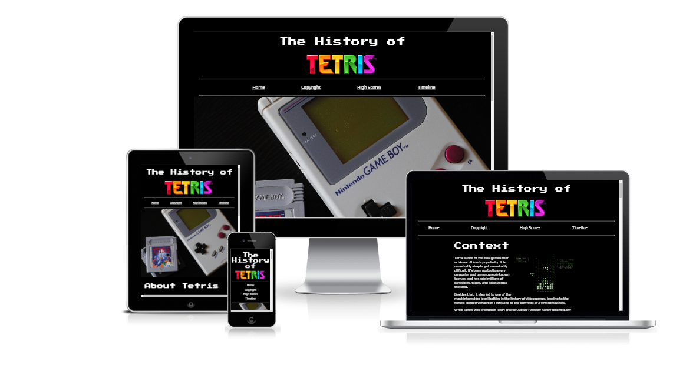

# The History of Tetris

The History of Tetris is a page dedicated to the history of one of the most popular video games to date. It offers information on Tetris' copyright and competitive scene history, as well as showing a timeline of notable versions of Tetris throughout the years in the form of a timeline. 

Users of this site will be able to find out any information they need regarding Tetris and it's history surrounding copyright, highscores/competitive scene and notable versions of the game. The target audience for this site is people of any age who have interest for Tetris.

## Features

-  ### **Header & Navigation** 

The header features on all pages, it includes a nav bar that links to the other main pages on the site. Every page has an identical header to allow for easy navigation. The Tetris logo is also clickable to get back to the home page as some users could expect this.

- ### **Embedded YouTube and Spotify**

Embedded youtube videos and spotify have been used to keep the user engaged and want to know more. This is beneficial as the user will spend more time on this site. 

- ### **Timeline Page** 
 
The timeline page features a vertical timeline to allow the user to easily view some of the most popular versions of the game. This benefits the user as they can quickly see information on each game. 

- ### **Sign Up Page**

This page allows the user to sign up to a mailing list. The user will have to give their first name and email address to sign up with the option of leaving out their surname or how many time they play Tetris. Users also have the option to clear the form if they make a mistake or change their mind. 

- ### **Footer**

The footer includes links to Tetris' Social Media platforms as well as links to the sign up page and the README.md for image and content credits. the README.md and each Social Media link opens in a new tab to allow for easy navigation for the user. The footer encourages the user to keep engaged with the latest Tetris developments. 

## Testing 

### Validator Testing
- #### **HTML**
    All pages have been through the official [W3C validator](https://validator.w3.org/) and the following is the output for each: 

    - **Home Page** 
        - Error for Youtube and Spotify iframe - "The frameborder attribute on the iframe element is obsolete. Use CSS instead." 
    
    - **Copyright Page**
        - No errors

    - **High Scores Page**
        - Error for Youtube iframe - "The frameborder attribute on the iframe element is obsolete. Use CSS instead."

    - **Timeline Page**
        - Warning for timeline list items all containing h1 elements - "Consider using the h1 element as a top-level heading only"

    - **Sign up Page**
        - No errors

- **CSS**

    - No errors were found when passing through the official [(Jigsaw) validator](https://jigsaw.w3.org/css-validator/validator?uri=https%3A%2F%2Fstephenbeese.github.io%2FPortfolio-Project-1%2F&profile=css3svg&usermedium=all&warning=1&vextwarning=&lang=en)

- **Accessibility**
    - I confirmed that the colours and fonts chosen are easy to read and accessible by running it through lighthouse in devtools 

## Bugs
### Unfixed Bugs
- No unfixed bugs

## Deployment
- This site was deployed to GitHub pages. The deploy steps are as follows:
    - In the GitHub repository, navigate to the settings tab
    - From the side bar navigate to pages
    - Once pages has been selected the page will show a link to the live website. 

The live link can be found here: https://stephenbeese.github.io/Portfolio-Project-1/ 

## Credits

## Content
- About Tetris section taken from Tetris Wikipedia - https://en.wikipedia.org/wiki/Tetris 

- Tetris Facts section taken from dailydot.com - https://www.dailydot.com/parsec/tetris-game-facts/

Copyright Page text taken from the following:

- http://www.atarihq.com/tsr/special/tetrishist.html

- https://www.youtube.com/watch?v=wEMHkzUOIE4 

High Scores Page text taken from the following: 

- https://tetris.wiki/Scoring#Original_Nintendo_scoring_system

- https://www.youtube.com/watch?v=bDsaQsCWbw4

- https://www.youtube.com/watch?v=n-BZ5-Q48lE&t=497s

- https://thectwc.com/history/ 

- https://www.polygon.com/23269073/competitive-classic-tetris-ctwc-jonas-neubauer-andy-michael-artiaga

- Timeline taken from: https://www.youtube.com/watch?v=zNccqv0g6Q4

Timeline text taken from the following: 

- https://tetris.fandom.com/wiki/List_of_games 

- https://en.wikipedia.org/wiki/Tetris_Party 

- https://en.wikipedia.org/wiki/Tetris_Effect 

Sign up form centering horizontally and vertically - https://www.youtube.com/watch?v=QdITQ4upjME

 ## Media

 ### Images 

- tetris-arcade.jpeg - https://www.vintagearcade.net/shop/arcade-games/tetris-arcade-game/

- tetris-nes.jpeg - https://en.wikipedia.org/wiki/Tetris_(NES_video_game)
  
- tetris-ibm-pc.webp - https://tetris.fandom.com/wiki/Tetris_(IBM_PC)

- electronica-60.png - https://awesomegames.miraheze.org/wiki/Tetris_(1984)

- Tetris-on-Game-Boy.jpeg - https://commons.wikimedia.org/wiki/File:Tetris_on_Game_Boy.jpg 

- tetris-background.jpeg - https://tetris.com/article/35/tetris-lingo-every-player-should-know

- tetris-tengen.jpeg - https://tetris.wiki/Tetris_(NES,_Tengen) 

- tetris-logo.png - https://en.wikipedia.org/wiki/The_Tetris_Company 

- tetris-gameboy.jpg - https://unsplash.com/photos/lUbIun4IL38 

- electronica-timeline.png - https://www.deviantart.com/rage-dssviper-sigma/art/Tetris-The-Grand-Master-Electronica-60-Style-569447060

- ibm-pc-timeline.png - https://online.oldgames.sk/play/dos/tetris/10050

- c64-timeline.jpeg - https://gamesdb.launchbox-app.com/games/images/144159

- gameboy-timeline.jpeg - https://www.mobygames.com/game/gameboy/tetris_gb/cover-art/gameCoverId,116199/ 

- snes-timeline.jpg - https://tetris.wiki/Tetris_%26_Dr._Mario 

- magical-timeline.png - https://www.deviantart.com/artchanxv/art/Magical-Tetris-Challenge-PS1-US-Box-Art-919440126 

- party-timeline.png - https://gamesdb.launchbox-app.com/games/images/23789 

- puyo-timeline.png - https://www.deviantart.com/goldmetalsonic/art/Puyo-Puyo-Tetris-Nintendo-Switch-Boxart-659832650 

- 99-timeline.jpg - https://www.amazon.co.uk/Tetris-99-NSO-Nintendo-Switch/dp/B07V8KPHS1 

- effect-timeline.jpeg - https://www.mobygames.com/game/playstation-4/tetris-effect/cover-art/gameCoverId,541797/ 

## Youtube / Spotify Links 

- https://www.youtube.com/watch?v=wEMHkzUOIE4 

- https://www.youtube.com/watch?v=n-BZ5-Q48lE

- https://www.youtube.com/watch?v=bDsaQsCWbw4 

- https://open.spotify.com/track/1dwTG4PVhiWzeu0fUfMMMb 